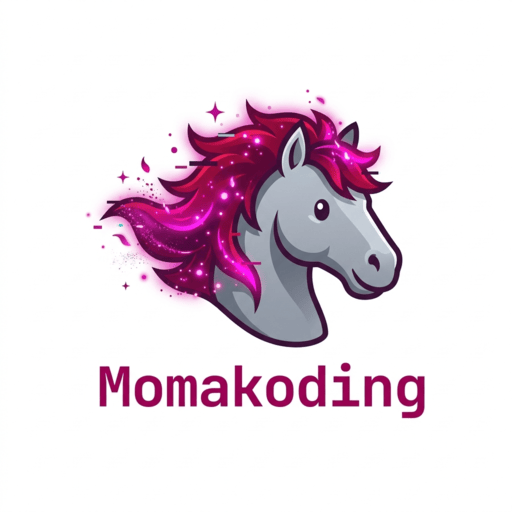

# 合奏课 · Ensemble Class Begins

> 倾听学生的故事，把它们弹成歌。

音游 × 叙事 × 教育艺术。一款关于倾听与演奏的小游戏。



## 快速开始

```bash
pnpm install
pnpm dev      # http://localhost:5173/
pnpm build    # 输出到 dist/
```

## 玩法

- 课堂中与三位学生对话，解锁各自的旋律关卡
- 通过全部关卡后，进入合奏 Boss 关
- 键盘 **D / F / J / K** 对应四条音轨，在判定线附近按键得分
- PERFECT / GOOD / MISS 三档判定，连击加成

## 技术栈

| 层 | 选型 |
|---|---|
| 游戏引擎 | Phaser 4 |
| UI 框架 | Vue 3 + TypeScript |
| 打包 | Vite 8 |
| 样式 | Tailwind CSS v4 |
| 路由 | vue-router 4 |
| 状态 | Pinia |

## 项目结构

```text
src/
├── engine/        # Phaser GameShell 封装 + EventBus
├── runtime/       # Vue 侧运行时桥接
├── contents/      # 游戏内容：场景 / 常量 / 数据 / 音频 / 谱面
└── pages/         # Vue 页面（主页 / 游戏 / 设置等）

src/contents/assets/midi/
├── 1.mid / 2.mid / 3.mid   # 三位学生的旋律
└── ensemble.mid             # 合奏 Boss 关谱面
```

## 开发文档

- [AGENTS.md](./AGENTS.md) — 多智能体协作协议
- [CHANGELOG.md](./CHANGELOG.md) — 变更记录
- [DECISION_LOG.md](./DECISION_LOG.md) — 架构决策日志
